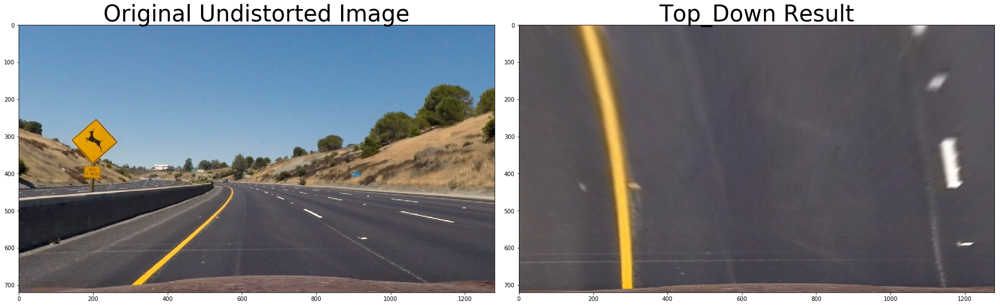

# CarND-Advanced-Lane-Finding-P4
This is the fourth project in the Udacity Self-Driving Car Nanodegree program. This project was performed in Jupyter notebook which has been exported and appended below.


# Project 4 - Advanced Lane Finding

Steps:

1. Camera calibration - Done
2. Distortion correction - Done
3. Color/gradient threshold - Done
4. Perspective transform - Done
5. Detect lane lines - Done
6. Determine the lane curvature - Done

## Initial Imports


```python
# Libraries used throughout are imported here

import pickle
import cv2
import numpy as np
import matplotlib.pyplot as plt
%matplotlib inline
import matplotlib.image as mpimg
import glob

# Import everything needed to edit/save/watch video clips
from moviepy.editor import VideoFileClip
from IPython.display import HTML
```

## Useful Methods


```python
#Most methods that need to be re-used are defined here 

# Function that takes an image, object points, and image points
# performs the camera calibration, image distortion correction and
# returns the undistorted image
def cal_undistort(img, objpoints, imgpoints):
gray = cv2.cvtColor(img,cv2.COLOR_BGR2GRAY)
# Use cv2.calibrateCamera and cv2.undistort()
ret, mtx, dist, rvecs, tvecs = cv2.calibrateCamera(objpoints, imgpoints, gray.shape[::-1],None,None)
# Undistorting a test image:
undist = cv2.undistort(img, mtx, dist, None, mtx)
return undist

def corners_unwarp(img, corners, nx, ny, mtx, dist):
#     # Use the OpenCV undistort() function to remove distortion
#     undist = cv2.undistort(img, mtx, dist, None, mtx)
#     # Convert undistorted image to grayscale
#     gray = cv2.cvtColor(undist, cv2.COLOR_BGR2GRAY)
offset = 100 # offset for dst points
# Grab the image shape
img_size = (img.shape[1], img.shape[0])
src = np.float32([corners[0], corners[1], corners[-1], corners[-nx]])
# For destination points, I'm arbitrarily choosing some points to be
# a nice fit for displaying our warped result 
# again, not exact, but close enough for our purposes
dst = np.float32([[offset, offset], [img_size[0]-offset, offset], 
[img_size[0]-offset, img_size[1]-offset], 
[offset, img_size[1]-offset]])
# Given src and dst points, calculate the perspective transform matrix
M = cv2.getPerspectiveTransform(src, dst)
# Warp the image using OpenCV warpPerspective()
warped = cv2.warpPerspective(img, M, img_size, flags=cv2.INTER_LINEAR)

# Return the resulting image and matrix
return warped, M

# Function that takes an image, gradient orientation,
# and threshold min / max values and returns output with threshold applied
def abs_sobel_thresh(img, orient='x', sobel_kernel=3, thresh=(0,255)):
# Convert to grayscale
gray = cv2.cvtColor(img, cv2.COLOR_RGB2GRAY)
# Apply x or y gradient with the OpenCV Sobel() function
# and take the absolute value
if orient == 'x':
abs_sobel = np.absolute(cv2.Sobel(gray, cv2.CV_64F, 1, 0))
if orient == 'y':
abs_sobel = np.absolute(cv2.Sobel(gray, cv2.CV_64F, 0, 1))
# Rescale back to 8 bit integer
scaled_sobel = np.uint8(255*abs_sobel/np.max(abs_sobel))
# Create a copy and apply the threshold
binary_output = np.zeros_like(scaled_sobel)
# Here I'm using inclusive (>=, <=) thresholds, but exclusive is ok too
binary_output[(scaled_sobel >= thresh[0]) & (scaled_sobel <= thresh[1])] = 1

# Return the result
return binary_output

# Function that takes image, kernel size, and threshold and returns
# magnitude of the gradient
def mag_threshold(img, sobel_kernel=3, mag_thresh=(0, 255)):
# Convert to grayscale
gray = cv2.cvtColor(img, cv2.COLOR_RGB2GRAY)
# Take both Sobel x and y gradients
sobelx = cv2.Sobel(gray, cv2.CV_64F, 1, 0, ksize=sobel_kernel)
sobely = cv2.Sobel(gray, cv2.CV_64F, 0, 1, ksize=sobel_kernel)
# Calculate the gradient magnitude
gradmag = np.sqrt(sobelx**2 + sobely**2)
# Rescale to 8 bit
scale_factor = np.max(gradmag)/255
gradmag = (gradmag/scale_factor).astype(np.uint8)
# Create a binary image of ones where threshold is met, zeros otherwise
binary_output = np.zeros_like(gradmag)
binary_output[(gradmag >= mag_thresh[0]) & (gradmag <= mag_thresh[1])] = 1

# Return the binary image
return binary_output

#function to threshold HSV color spectrum in an image for a given range
def color_threshold_hsv(img, channel="s", thresh=(170,255)):
img = np.copy(img)
# Convert to HSV color space and separate the V channel
hsv = cv2.cvtColor(img, cv2.COLOR_RGB2HLS).astype(np.float)
h_channel = hsv[:,:,0]
l_channel = hsv[:,:,1]
s_channel = hsv[:,:,2]

if channel == "h":
target_channel = h_channel
elif channel == "l":
target_channel = l_channel
else:
target_channel = s_channel

# Threshold color channel
binary_output = np.zeros_like(target_channel)
binary_output[(target_channel >= thresh[0]) & (target_channel <= thresh[1])] = 1

return binary_output

#function to threshold RGB color spectrum in an image for a given range
def color_threshold_rgb(img, channel="r", thresh=(170,255)):
img = np.copy(img)
r_channel = img[:,:,0]
g_channel = img[:,:,1]
b_channel = img[:,:,2]

if channel == "r":
target_channel = r_channel
elif channel == "g":
target_channel = g_channel
else:
target_channel = b_channel

# Threshold color channel
binary_output = np.zeros_like(target_channel)
binary_output[(target_channel >= thresh[0]) & (target_channel <= thresh[1])] = 1

return binary_output

#function to threshold HSV color spectrum in an image for a given range
def color_threshold_yuv(img, channel="v", thresh=(0,255)):
img = np.copy(img)
# Convert to YUV color space and separate the V channel
yuv = cv2.cvtColor(img, cv2.COLOR_RGB2YUV).astype(np.float)
y_channel = yuv[:,:,0]
u_channel = yuv[:,:,1]
v_channel = yuv[:,:,2]

if channel == "y":
target_channel = y_channel
elif channel == "u":
target_channel = u_channel
else:
target_channel = v_channel

# Threshold color channel
binary_output = np.zeros_like(target_channel)
binary_output[(target_channel >= thresh[0]) & (target_channel <= thresh[1])] = 1

return binary_output

# Function to threshold gradient direction in an image for a given range and Sobel kernel
def dir_threshold(img, sobel_kernel=3, thresh=(0, np.pi/2)):
# Grayscale
gray = cv2.cvtColor(img, cv2.COLOR_RGB2GRAY)
# Calculate the x and y gradients
sobelx = cv2.Sobel(gray, cv2.CV_64F, 1, 0, ksize=sobel_kernel)
sobely = cv2.Sobel(gray, cv2.CV_64F, 0, 1, ksize=sobel_kernel)
# Take the absolute value of the gradient direction,
# apply a threshold, and create a binary image result
absgraddir = np.arctan2(np.absolute(sobely), np.absolute(sobelx))
binary_output =  np.zeros_like(absgraddir)
binary_output[(absgraddir >= thresh[0]) & (absgraddir <= thresh[1])] = 1

# Return the binary image
return binary_output

def pipeline_hsv(img, sobel_kernel=3, s_thresh=(170, 255), sx_thresh=(20, 100), sy_thresh=(20,120), mag_thresh=(0,255)):
img = np.copy(img)
# Convert to HSV color space and separate the V channel
hsv = cv2.cvtColor(img, cv2.COLOR_RGB2HLS).astype(np.float)
l_channel = hsv[:,:,1]
s_channel = hsv[:,:,2]

# Sobel x
sobelx = cv2.Sobel(l_channel, cv2.CV_64F, 1, 0, ksize=23) # Take the derivative in x
abs_sobelx = np.absolute(sobelx) # Absolute x derivative to accentuate lines away from horizontal
#scaled_sobel = np.uint8(255*abs_sobelx/np.max(abs_sobelx))

# Sobel y
sobely = cv2.Sobel(s_channel, cv2.CV_64F, 0, 1, ksize=23) # Take the derivative in y
abs_sobely = np.absolute(sobely) # Absolute y derivative to accentuate lines away from vertical
scaled_sobel = np.uint8(255*abs_sobely/np.max(abs_sobely))

# Threshold x gradient
sxbinary = np.zeros_like(scaled_sobel)
sxbinary[(scaled_sobel >= sx_thresh[0]) & (scaled_sobel <= sx_thresh[1])] = 1

# Threshold y gradient
sybinary = np.zeros_like(scaled_sobel)
sybinary[(scaled_sobel >= sy_thresh[0]) & (scaled_sobel <= sy_thresh[1])] = 1

magbinary = mag_threshold(img, sobel_kernel, mag_thresh)

# Threshold color channel
s_binary = np.zeros_like(s_channel)
s_binary[(s_channel >= s_thresh[0]) & (s_channel <= s_thresh[1])] = 1
# Stack each channel
# Note color_binary[:, :, 0] is all 0s, effectively an all black image. It might
# be beneficial to replace this channel with something else.
color_binary = np.dstack(( np.zeros_like(sxbinary), magbinary, sxbinary, sybinary, s_binary))
return color_binary

def myPipeline(img):
ksize = 3
gradx = abs_sobel_thresh(img, orient='x', sobel_kernel=ksize, thresh=(10, 100))
grady = abs_sobel_thresh(img, orient='y', sobel_kernel=ksize, thresh=(5, 250))
mag_binary = mag_threshold(img, sobel_kernel=ksize, mag_thresh=(5, 100))
dir_binary = dir_threshold(img, sobel_kernel=ksize, thresh=(0, np.pi/2))
s_binary = color_threshold_hsv(img, "s", (120,255))
v_binary = color_threshold_yuv(img,"v", (0,105))
r_binary = color_threshold_rgb(img,"r", (230,255))
result = np.zeros_like(dir_binary)
result[((gradx == 1) & (grady == 1)) | ((mag_binary == 1) & (dir_binary == 1)) & ((s_binary == 1)) | ((v_binary ==1) | (r_binary == 1))] = 1
return result

def warp(img):
img_size = (img.shape[1],img.shape[0])
#Four Source coordinates
source = np.float32([[(.42 * img.shape[1], .65 * img.shape[0] ),(.58 * img.shape[1], .65 * img.shape[0]),(0 * img.shape[1],img.shape[0]),(1 * img.shape[1], img.shape[0])]])
#vertices = np.array([[(.16 * imshape[1], .92 * imshape[0]), (.45 * imshape[1], .63 * imshape[0] ),(.6 * imshape[1], .63 * imshape[0] ),(.9 * imshape[1],.92 *imshape[0])]], dtype=np.int32)  

#Four desired coordinates
dest = np.float32([[0,0],[img.shape[1],0],[0,img.shape[0]],[img.shape[1],img.shape[0]]])
M = cv2.getPerspectiveTransform(source, dest)
Minv = cv2.getPerspectiveTransform(dest, source)
warped = cv2.warpPerspective(img,M,img_size)
return warped, M, Minv

# Define a class to receive the characteristics of each line detection
class Line():
def __init__(self):
# was the line detected in the last iteration?
self.detected = False  
# x values of the last n fits of the line
self.recent_xfitted = [] 
#average x values of the fitted line over the last n iterations
self.bestx = None     
#polynomial coefficients averaged over the last n iterations
self.best_fit = None  
#polynomial coefficients for the most recent fit
self.current_fit = [np.array([False])]  
#radius of curvature of the line in some units
self.radius_of_curvature = None 
#distance in meters of vehicle center from the line
self.line_base_pos = None 
#difference in fit coefficients between last and new fits
self.diffs = np.array([0,0,0], dtype='float') 
#x values for detected line pixels
self.allx = None  
#y values for detected line pixels
self.ally = None

# methods from Project 1:
# -----------------------
##Custom Display Image helper function
def displayImage(image, gray=False, title="Displayed Image"):
"""loads the image and displays in output, in grayscale if param gray is true
"""
if(not gray):
plt.imshow(image)
#call as plt.imshow(gray, cmap='gray') to show a grayscaled image
else:
plt.imshow(image, cmap='gray')

def grayscale(img):
"""Applies the Grayscale transform
This will return an image with only one color channel
but NOTE: to see the returned image as grayscale
you should call plt.imshow(gray, cmap='gray')"""
return cv2.cvtColor(img, cv2.COLOR_RGB2GRAY)

def region_of_interest(img, vertices):
"""
Applies an image mask.

Only keeps the region of the image defined by the polygon
formed from `vertices`. The rest of the image is set to black.
"""
#defining a blank mask to start with
mask = np.zeros_like(img)   

#defining a 3 channel or 1 channel color to fill the mask with depending on the input image
if len(img.shape) > 2:
channel_count = img.shape[2]  # i.e. 3 or 4 depending on your image
ignore_mask_color = (255,) * channel_count
else:
ignore_mask_color = 255

#filling pixels inside the polygon defined by "vertices" with the fill color    
cv2.fillPoly(mask, vertices, ignore_mask_color)

#returning the image only where mask pixels are nonzero
masked_image = cv2.bitwise_and(img, mask)
return masked_image

def img_overlay(img_lines, initial_img, α=0.8, β=1., λ=0.):
"""
`img_lines` is the output of lane dectection, An image with lines drawn on it.
Should be a blank image (all black) with lines drawn on it.

`initial_img` should be the image before any processing.

The result image is computed as follows:

initial_img * α + img * β + λ
NOTE: initial_img and img must be the same shape!
"""
return cv2.addWeighted(initial_img, α, img, β, λ)

# Other Helpers -------->
def readImage(img):
"""
Read the image and convert to RGB for plot
"""
img_read = cv2.imread(img)
img_RGB =  cv2.cvtColor(img_read, cv2.COLOR_BGR2RGB)
return img_RGB
#Ignore the .DS_Store files because of Mac OS
def listdir_nohidden(path):
return glob.glob(os.path.join(path, '*'))
```

## Implementation 

First I add the image files from the directory and inspect to see what the size is and that the plotting works correctly


```python

#Import images
import os

calImageFiles = listdir_nohidden("camera_cal")
calImages = []
testImageFiles = listdir_nohidden("test_images")
testImages = []
for f in calImageFiles:
calImages.append(readImage(f))

for imageText in testImageFiles:
testImages.append(readImage(imageText))
```


```python
img = testImages[0]
#printing out some stats and plotting
print('This image is:', type(img), 'with dimesions:', img.shape)
displayImage(img, False)

```

This image is: <class 'numpy.ndarray'> with dimesions: (720, 1280, 3)


## Find Corners for Image Points and Object Points to Calibrate and Undistort

My next step is to calibrate the camera and undistort based upon the checkerboard images provided


```python
# prepare object points, like (0,0,0), (1,0,0), (2,0,0) ....,(6,5,0)
objp = np.zeros((6*9,3), np.float32)
objp[:,:2] = np.mgrid[0:9, 0:6].T.reshape(-1,2)

# Arrays to store object points and image points from all the images.
objpoints = [] # 3d points in real world space
imgpoints = [] # 2d points in image plane.

# Step through the list and search for corners
for idx, fname in enumerate(calImageFiles):
img = cv2.imread(fname)
gray = cv2.cvtColor(img, cv2.COLOR_BGR2GRAY)
# find the corners
#corners = cv2.goodFeaturesToTrack(gray,nCorners,0.01,10)
ret,corners = cv2.findChessboardCorners(gray, (9,6), None)
# If found, add object points, image points
if ret == True:
objpoints.append(objp)
imgpoints.append(corners)
# Draw and display the corners
cv2.drawChessboardCorners(img, (9,6), corners, ret)
#write_name = 'corners_found'+str(idx)+'.jpg'
#cv2.imwrite(write_name, img)
```


```python
#Test on first calibration image
distImg = calImages[0]
undistorted = cal_undistort(distImg, objpoints, imgpoints)
cv2.imwrite('output_images/undistorted_checkerboard.jpg', undistorted)
plt.imshow(undistorted), plt.show()
```


(<matplotlib.image.AxesImage at 0x126ff7f60>, None)


## With image and object points perform calibrate and undistort

Now with the calibration completed I can undistort the images from the car and visualize below


```python
undistortedImages = []
for idx,image in enumerate(testImages):
undistorted = cal_undistort(image, objpoints, imgpoints)
cv2.imwrite('output_images/undistortedTestImage'+str(idx)+'.jpg', cv2.cvtColor(undistorted, cv2.COLOR_BGR2RGB))
undistortedImages.append(undistorted)
```

## Visualize undistortion


```python
for idx, img in enumerate(undistortedImages):
f, (ax1, ax2) = plt.subplots(1, 2, figsize=(20,10))
ax1.imshow(testImages[idx])
ax1.set_title('Original Image', fontsize=30)
ax2.imshow(img)
ax2.set_title('Undistorted Image', fontsize=30)
```


## Determine region of interest

The next step is to determine the area of perspective transformation on the road. I chose a wide area rather than a narrow band along side the lines. I chose to do this because I had planned on gathering more information about the road edges in the future or if there was a case where lanes were wider or no line was available on a particular side.


```python
# Determine the region of interest
img = np.copy(undistortedImages[0])
imshape = img.shape
pts = np.array([(0 * imshape[1], imshape[0]), (.41 * imshape[1], .65 * imshape[0] ),(.59 * imshape[1], .65 * imshape[0] ),(imshape[1], imshape[0])], np.int32)
pts = pts.reshape((-1,1,2))
img = cv2.polylines(img,[pts],True,(255,0,0))
# vertices = np.array([[(0 * imshape[1], imshape[0]), (.41 * imshape[1], .65 * imshape[0] ),(.59 * imshape[1], .65 * imshape[0] ),(imshape[1], imshape[0])]], dtype=np.int32)  
# masked_image = region_of_interest(img, vertices)
# Plot the result
f, (ax1, ax2) = plt.subplots(1, 2, figsize=(24, 9))
f.tight_layout()

ax1.imshow(undistortedImages[0])
ax1.set_title('Original Undistorted Image', fontsize=40)

ax2.imshow(img)
ax2.set_title('Area of transformation', fontsize=40)
plt.subplots_adjust(left=0., right=1, top=0.9, bottom=0.)
```


## Perform the Perspective Transformation and visualize


```python
top_down_images = []
for idx,img in enumerate(undistortedImages):
top_down, M, Minv = warp(img)
unwarped = cv2.warpPerspective(top_down, Minv,(undistortedImages[0].shape[1],undistortedImages[0].shape[0]),flags=cv2.INTER_LINEAR)
top_down_images.append(top_down)
cv2.imwrite('output_images/top_down_transformation'+str(idx)+'.jpg', cv2.cvtColor(top_down, cv2.COLOR_BGR2RGB))
# Plot the result
f, (ax1, ax2) = plt.subplots(1, 2, figsize=(24, 9))
f.tight_layout()

ax1.imshow(img)
ax1.set_title('Original Undistorted Image', fontsize=40)

ax2.imshow(top_down)
ax2.set_title('Top_Down Result', fontsize=40)
plt.subplots_adjust(left=0., right=1, top=0.9, bottom=0.)
```





## Apply Color and Gradient thresholds

The next step is apply color and gradient thresholds in my pipeline to determine the pixels most likely to be lane lines. My pipeline consists of color and Sobel gradient thresholds.


```python
edges = []
for idx, img in enumerate(top_down_images):
result = myPipeline(img) #mag_threshold(img, 3, (10,200)) #abs_sobel_thresh(img, orient='x', sobel_kernel=3, thresh=(0,255)):

#add to edges
edges.append(result)
# Plot the result
f, (ax1, ax2) = plt.subplots(1, 2, figsize=(24, 9))
f.tight_layout()

ax1.imshow(img)
ax1.set_title('Warped Image', fontsize=40)

ax2.imshow(result, cmap='gray')
ax2.set_title('Pipeline Result', fontsize=40)
plt.subplots_adjust(left=0., right=1, top=0.9, bottom=0.)
f.savefig('output_images/pipeline_result'+str(idx)+'.jpg')
```


## Detect Lines

The next step is to determine where the lane lines are and separate them from the noise after the thresholds are applied in the pipeline. Once the points of the line are determined in the image I then fit a second-order polynomial line to best fit those points.


```python
from scipy import signal

def detectLines(img, line, direction="left"):
'''
# was the line detected in the last iteration?
self.detected = False  
# x values of the last n fits of the line
self.recent_xfitted = [] 
#average x values of the fitted line over the last n iterations
self.bestx = None     
#polynomial coefficients averaged over the last n iterations
self.best_fit = None  
#polynomial coefficients for the most recent fit
self.current_fit = [np.array([False])]  
#radius of curvature of the line in some units
self.radius_of_curvature = None 
#distance in meters of vehicle center from the line
self.line_base_pos = None 
#difference in fit coefficients between last and new fits
self.diffs = np.array([0,0,0], dtype='float') 
#x values for detected line pixels
self.allx = None  
#y values for detected line pixels
self.ally = None
'''

winWidth = 25
winHeight = 50 #bigger numbers create smaller windows as it is calculated as a proportion to the img height

if not line.detected:
histogram = np.sum(img[img.shape[0]*(.5):,0:img.shape[1]], axis=0)
#plt.plot(histogram)

#find two peaks first is the left and last is the right
#initial peak
peakind = signal.find_peaks_cwt(histogram, np.arange(100,200))
if direction == 'left':
peak = peakind[0]
else:
peak = peakind[-1]

#move the sliding window across and gather the points
yvals = []
xvals = []

for i in range(winHeight):
#peaks may be at the edge so we need to stop at the edge
if direction == 'left':
if peak < winWidth:
peak = winWidth
else:
if peak >= (img.shape[1] - winWidth):
peak = img.shape[1] - winWidth - 1

for yval in range(int(img.shape[0]*((winHeight-i-1)/winHeight)), int(img.shape[0]*((winHeight-i)/winHeight))):
for xval in range(peak-winWidth, peak+winWidth):
if img[yval][xval] == 1.0:
yvals.append(yval)
xvals.append(xval)
#find new peaks to move the window accordingly for next iteration
#new peaks will be the max in the current window plus the beginning of the window...

histogram = np.sum(img[img.shape[0]*((winHeight-i-1)/winHeight):img.shape[0]*((winHeight-i)/winHeight),peak-winWidth:peak+winWidth], axis=0)
if len(signal.find_peaks_cwt(histogram, np.arange(100,200))) > 0:
peak = np.amax(signal.find_peaks_cwt(histogram, np.arange(100,200))) + (peak-winWidth)
else: #look in bigger window
winWidthBig = 100
histogram = np.sum(img[img.shape[0]*((winHeight-i-1)/winHeight):img.shape[0]*((winHeight-i)/winHeight),peak-winWidthBig:peak+winWidthBig], axis=0)
if len(histogram > 0):
if len(signal.find_peaks_cwt(histogram, np.arange(100,200))) > 0:
peak = np.amax(signal.find_peaks_cwt(histogram, np.arange(100,200))) + (peak-winWidthBig)

yvals = np.asarray(yvals)
xvals = np.asarray(xvals)

line.allx = xvals
line.ally = yvals

# Fit a second order polynomial to lane line
fit = np.polyfit(yvals, xvals, 2)

line.current_fit = fit
line.best_fit = fit
#print(fit)

fitx = fit[0]*yvals**2 + fit[1]*yvals + fit[2]
#print(fitx)

line.recent_xfitted.append(fitx)
line.bestx = fitx

# Set detected to true - This is now done when the line is checked for accuracy
#line.detected = True 

else:
#initial peak - use previous line x
peak = line.bestx[0]
prev_line = copy(line)

#move the sliding window across and gather the points
yvals = []
xvals = []

for i in range(winHeight):
#peaks may be at the edge so we need to stop at the edge
if direction == 'left':
if int(peak) < winWidth:
peak = winWidth
else:
if int(peak) >= (img.shape[1] - winWidth):
peak = img.shape[1] - winWidth - 1

for yval in range(int(img.shape[0]*((winHeight-i-1)/winHeight)), int(img.shape[0]*((winHeight-i)/winHeight))):
for xval in range(int(peak-winWidth), int(peak+winWidth)):
if img[yval][xval] == 1.0:
yvals.append(yval)
xvals.append(xval)
#use bestx to keep going over the line
peak = line.bestx[(i + 1)%len(line.bestx)]

yvals = np.asarray(yvals)
xvals = np.asarray(xvals)

line.allx = xvals
line.ally = yvals

# Fit a second order polynomial to lane line
fit = np.polyfit(yvals, xvals, 2)
line.current_fit = fit
fitx = fit[0]*yvals**2 + fit[1]*yvals + fit[2]

isOk = checkDetection(prev_line, line)
if isOk:
if len(line.recent_xfitted) > 10:
#remove the first element
line.recent_xfitted.pop(0)
line.recent_xfitted.append(fitx)
line.bestx = fitx
line.best_fit = fit
else:
#line lost, go back to sliding window
line.detected = false

return line

def checkDetection(prev_line, next_line):
# Checking that they have similar curvature
left_curvature = getCurvature(prev_line.allx, prev_line.ally, prev_line.current_fit )
right_curvature = getCurvature(next_line.allx, next_line.ally, next_line.current_fit)
# Checking that they are separated by approximately the right distance horizontally
left_x = prev_line.recent_xfitted[0][0]
right_x = next_line.recent_xfitted[0][0]
if (np.absolute(left_x - right_x) > 1000) | (np.absolute(left_curvature - right_curvature) > 100): #in pixels, not meters
prev_line.detected = False
next_line.detected = False
return False
# Checking that they are roughly parallel- TODO // the curvature tells this partially...

prev_line.detected = True #in case these are different lines that are being compared
next_line.detected = True
return True


#to keep track of lines
detectedLines = []
for idx,img in enumerate(edges):
left_line = Line()
right_line = Line()
left_line = detectLines(img, left_line, 'left')
right_line = detectLines(img, right_line, 'right')
detectedLines.append({'left_line': left_line, 'right_line': right_line })

# Plot the result
f, (ax1, ax2) = plt.subplots(1, 2, figsize=(24, 9))
f.tight_layout()

ax1.imshow(img, cmap='gray')
ax1.set_title('Pipeline Results', fontsize=40)

# Plot up the data
ax2.plot(left_line.allx, left_line.ally, 'o', color='red')
ax2.plot(right_line.allx, right_line.ally, 'o', color='blue')
plt.xlim(0, 1280)
plt.ylim(0, 720)
ax2.plot(left_line.bestx, left_line.ally, color='green', linewidth=3)
ax2.plot(right_line.bestx, right_line.ally, color='green', linewidth=3)
plt.gca().invert_yaxis() # to visualize as we do the images
ax2.set_title('Line Fits', fontsize=40)
plt.subplots_adjust(left=0., right=1, top=0.9, bottom=0.)
f.savefig('output_images/line_fit_'+str(idx)+'.jpg')


```


## Determine the lane and project back onto the undistorted Image

The next step is to use the two fitted lines for the lane and create a polygon fill for the lane and project it back into the original undistorted image using the inverse transformation matrix from the transformation process earlier.


```python
# Define y-value where we want radius of curvature
# I'll choose the maximum y-value, corresponding to the bottom of the image
def getCurvature(line_x, line_y, fit):

y_eval = np.max(line_y)
curverad = ((1 + (2*fit[0]*y_eval + fit[1])**2)**1.5) \
/np.absolute(2*fit[0])

# Define conversions in x and y from pixels space to meters
ym_per_pix = 30/720 # meters per pixel in y dimension
xm_per_pix = 3.7/700 # meteres per pixel in x dimension

fit_cr = np.polyfit(line_y*ym_per_pix, line_x*xm_per_pix, 2)

curverad = ((1 + (2*fit_cr[0]*y_eval + fit_cr[1])**2)**1.5) \
/np.absolute(2*fit_cr[0])

# Now our radius of curvature is in meters
#print(left_curverad, 'm', right_curverad, 'm')
# Example values: 3380.7 m    3189.3 m

return curverad
# Example values: 1163.9    1213.7

def getCenterDiff(img,lines):
#midpoint of the lines (half the polyfill width)
midPoly = (lines['right_line'].bestx[0] - lines['left_line'].bestx[0]) / 2
#midpoint of the image (half the image length)
midImage = img.shape[0] / 2

diffInPix = midImage - midPoly
#convert to meters
xm_per_pix = 3.7/700 # meteres per pixel in x dimension
result = diffInPix * xm_per_pix
lines['left_line'].line_base_pos = result
lines['right_line'].line_base_pos = result
return result


def imgWithLane(undist, warped, lines):
undist = np.copy(undist)
# Create an image to draw the lines on
warp_zero = np.zeros_like(img).astype(np.uint8)
color_warp = np.dstack((warp_zero, warp_zero, warp_zero))

# Recast the x and y points into usable format for cv2.fillPoly()
pts_left = np.array([np.transpose(np.vstack([lines['left_line'].allx, lines['left_line'].ally]))])
pts_right = np.array([np.flipud(np.transpose(np.vstack([lines['right_line'].allx, lines['right_line'].ally])))])
pts = np.hstack((pts_left, pts_right))

# Draw the lane onto the warped blank image
cv2.fillPoly(color_warp, np.int_([pts]), (0,255, 0))

#Draw the points on the image
for idx,pt in enumerate(lines['left_line'].ally):
#cv2.circle(img,(447,63), 63, (0,0,255), -1)
cv2.circle(color_warp,(lines['left_line'].allx[idx], pt), 2, (255,0,0), -1)

for idx,pt in enumerate(lines['right_line'].ally):
#cv2.circle(img,(447,63), 63, (0,0,255), -1)
cv2.circle(color_warp,(lines['right_line'].allx[idx], pt), 2, (0,0,255), -1)

#get the radius curvature
left_curverad = getCurvature(lines['left_line'].allx, lines['left_line'].ally, lines['left_line'].best_fit)
right_curverad = getCurvature(lines['right_line'].allx, lines['right_line'].ally, lines['right_line'].best_fit)
left_text = 'Left Curvature Radius: ' + str(np.around(left_curverad,2)) + 'm'
right_text = 'Right Curvature Radius: ' + str(np.around(right_curverad,2)) + 'm'

#get the distance from the center
center_diff = getCenterDiff(undist, lines)
if center_diff < 0:
center_diff_text = 'Vehicle Position: ' + str(np.around(np.absolute(center_diff),2)) + 'm left of center'
else:
center_diff_text = 'Vehicle Position: ' + str(np.around(center_diff,2)) + 'm right of center'

font = cv2.FONT_HERSHEY_SIMPLEX
cv2.putText(undist,left_text,(10,50), font, 1,(255,255,255),2,cv2.LINE_AA)
cv2.putText(undist,right_text,(10,100), font, 1,(255,255,255),2,cv2.LINE_AA)
cv2.putText(undist,center_diff_text,(10,150), font, 1,(255,255,255),2,cv2.LINE_AA)

# Warp the blank back to original image space using inverse perspective matrix (Minv)
newwarp = cv2.warpPerspective(color_warp, Minv, (img.shape[1], img.shape[0])) 
# Combine the result with the original image
result = cv2.addWeighted(undist, 1, newwarp, 0.3, 0)
return result

#check test images
for idx,img in enumerate(edges):
result = imgWithLane(undistortedImages[idx],img, detectedLines[idx])
cv2.imwrite('output_images/imgWithLane'+str(idx)+'.jpg', cv2.cvtColor(result, cv2.COLOR_BGR2RGB))
# Plot the result
f, (ax1, ax2) = plt.subplots(1, 2, figsize=(24, 9))
f.tight_layout()

ax1.imshow(undistortedImages[idx], cmap='gray')
ax1.set_title('Undistorted Image', fontsize=40)

ax2.imshow(result)
ax2.set_title('Image with lane detected', fontsize=40)

```


## Test performance on video

Now with the images performing well it's time to test on a video!


```python
#new lines to keep track in video
theLeftLine = Line()
theRightLine = Line()

def processImage(img):
#go through each step in the process
#1. Calibrate and undistort
undistorted = cal_undistort(img, objpoints, imgpoints)
#2. warp
top_down, M, Minv = warp(undistorted)
#3. Convert to binary with thresholds
binary_top_down = myPipeline(top_down)
#4. Detect the lines and fit polynomial
leftline = detectLines(binary_top_down, theLeftLine, 'left')
rightline = detectLines(binary_top_down, theRightLine, 'right')
lines = {'left_line': leftline, 'right_line': rightline }
#5. Unwarp and project onto original image
result = imgWithLane(undistorted, binary_top_down, lines)
return result


```

The video ouput: Here is a link to the youtube video:
<iframe width="560" height="315" src="https://www.youtube.com/embed/ae6tgDPAvy8" frameborder="0" allowfullscreen></iframe>


```python
video_output = 'project_video_output.mp4'
clip1 = VideoFileClip("project_video.mp4")

output_clip = clip1.fl_image(processImage) #NOTE: this function expects color images!!
%time output_clip.write_videofile(video_output, audio=False)
```

[MoviePy] >>>> Building video project_video_output.mp4
[MoviePy] Writing video project_video_output.mp4


100%|█████████▉| 1260/1261 [5:27:29<00:04,  4.03s/it]     


[MoviePy] Done.
[MoviePy] >>>> Video ready: project_video_output.mp4 

CPU times: user 1h 42min 29s, sys: 5min 57s, total: 1h 48min 26s
Wall time: 5h 27min 30s


```python
HTML("""
<video width="960" height="540" controls>
<source src="{0}">
</video>
""".format(video_output))
```


<video width="960" height="540" controls>
<source src="project_video_output.mp4">
</video>


## Challenge Video 1

I did the challenge video and performed just ok. The problem my lane detecter had was with the lane width. I grabbed a wide area for the perspective transformation and these lanes are more narrow than the other video the result is that the edge of the road gets confused as a lane line.


```python
challenge_video_output = 'challenge_video_output.mp4'
clip2 = VideoFileClip("challenge_video.mp4")

output_clip_challenge = clip2.fl_image(processImage) #NOTE: this function expects color images!!
%time output_clip_challenge.write_videofile(challenge_video_output, audio=False)
```

[MoviePy] >>>> Building video challenge_video_output.mp4
[MoviePy] Writing video challenge_video_output.mp4


100%|██████████| 485/485 [33:37<00:00,  4.34s/it]


[MoviePy] Done.
[MoviePy] >>>> Video ready: challenge_video_output.mp4 

CPU times: user 33min 36s, sys: 38.2 s, total: 34min 14s
Wall time: 33min 38s


```python
HTML("""
<video width="960" height="540" controls>
<source src="{0}">
</video>
""".format(challenge_video_output))
```


<video width="960" height="540" controls>
<source src="challenge_video_output.mp4">
</video>


## Challenge on Harder Video

I also looked at the harder video challenge to see performance there. As before the result with the narrow lanes and the road edge was not good. Also the motorcycle at the beginning gets confused with lane lines so the check on the lane line consistency failed here. I ran out of time to run more thorough tests and make improvements but I plan on going back and working on it some more to get better results!

NOTE: There was an error in the code that occurred while writing the video output. I ran out of time to correct it but plan on it correcting it soon.


```python
harder_challenge_video_output = 'harder_challenge_video_output.mp4'
clip3 = VideoFileClip("harder_challenge_video.mp4")

output_clip_challenge2 = clip3.fl_image(processImage) #NOTE: this function expects color images!!
%time output_clip_challenge2.write_videofile(harder_challenge_video_output, audio=False)
```

```python
HTML("""
<video width="960" height="540" controls>
<source src="{0}">
</video>
""".format(harder_challenge_video_output))
```


<video width="960" height="540" controls>
<source src="harder_challenge_video_output.mp4">
</video>


```python

```
